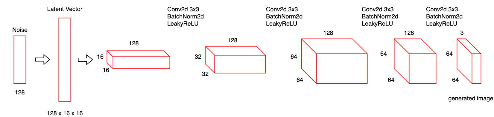
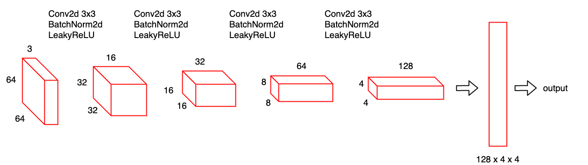
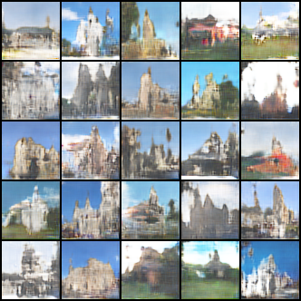
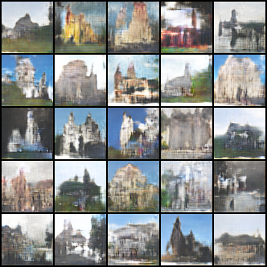

This repo implements LS GAN with training dataset is LSUN dataset(church outdoor)

it contains:
1. data_loader.py supports pytorch data loader
2. model.py defines generator and discriminator
3. train.py
4. utils.py provides necessary libraries

Finally, in inference.py, you are able to run generator to create fake images, please check carefully several paths.
I provided temporary checkpoint in folder "checkpoint/"

Model architectures:

  
  
Generator

  
  
Discriminator

Several generations:

  
  
Fake images example

  
  
Fake images example

